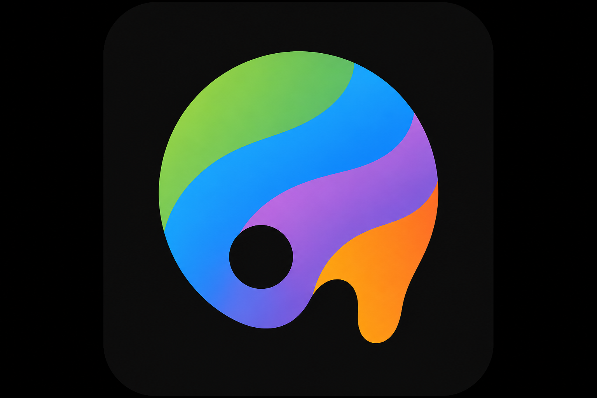

<p align="center">
  <strong>Frontier Themes</strong>
</p>

<p align="center">
  Brand-inspired color themes for VS Code &amp; Cursor — with live preview and optional aurora backgrounds.
</p>

<p align="center">
  
</p>

## About

Frontier Themes is a collection of **48 color themes** (light + dark) inspired by well-known tech companies and AI startups. Each theme includes syntax highlighting, workbench colors, and terminal palettes tuned to that brand.

Use the **status bar picker** to switch themes quickly, **preview with ↑↓** before applying, and optionally enable a **brand-matched aurora** animated background.

> Brand names and colors are inspired by public identities. This project is not affiliated with or endorsed by any company listed.

## Installation

### Marketplace / VSIX

Launch **Quick Open**

- Linux `Ctrl+P`
- macOS `⌘P`
- Windows `Ctrl+P`

Install from a packaged VSIX:

```bash
git clone https://github.com/EthannHongg/frontier-themes.git
cd frontier-themes
npm install && npm run generate && npm run package
```

Then: Extensions → `...` → **Install from VSIX** → select `frontier-themes-1.1.0.vsix`

Or search **Frontier Themes** on the VS Code Marketplace (after publish).

### Activate a theme

1. Click **`$(symbol-color)`** in the status bar (bottom-right), **or**
2. Command Palette → **Frontier Themes: Pick Theme**, **or**
3. Gear menu → **Color Theme** → pick e.g. `OpenAI Dark`

## Variants

### Big Tech

| | Dark | Light |
|---|:---:|:---:|
| Google | ✓ | ✓ |
| Apple | ✓ | ✓ |
| Meta | ✓ | ✓ |
| Amazon | ✓ | ✓ |
| Netflix | ✓ | ✓ |
| Microsoft | ✓ | ✓ |
| NVIDIA | ✓ | ✓ |
| Tesla | ✓ | ✓ |
| SpaceX | ✓ | ✓ |
| Salesforce | ✓ | ✓ |
| Adobe | ✓ | ✓ |
| IBM | ✓ | ✓ |

### AI & Startups

| | Dark | Light |
|---|:---:|:---:|
| OpenAI | ✓ | ✓ |
| Anthropic | ✓ | ✓ |
| Perplexity | ✓ | ✓ |
| Cursor | ✓ | ✓ |
| Mistral | ✓ | ✓ |
| Cohere | ✓ | ✓ |
| Stability AI | ✓ | ✓ |
| Hugging Face | ✓ | ✓ |
| Replicate | ✓ | ✓ |
| Vercel | ✓ | ✓ |
| Linear | ✓ | ✓ |
| Figma | ✓ | ✓ |

## Features

### Theme picker with color swatches

The quick-pick menu shows a **color swatch icon** per theme (primary, secondary, accent on the editor background).

### Live preview (↑↓)

While the picker is open:

- **↑ / ↓** — instantly preview the highlighted theme
- **Enter** — apply the selection
- **Esc** — cancel and **revert** to your previous theme

### Aurora backgrounds (optional)

A slow, iridescent animated background behind your editor — adapted from [AuroraBg](https://github.com/crlang44/AuroraBg) with per-brand palette tuning.

Toggle via **`$(sparkle) Aurora On/Off`** in the status bar.

#### Cursor / helper extension

Aurora injects a small WebGL script into the editor UI. That requires a **helper extension** — the classic one is [Custom CSS and JS Loader](https://marketplace.visualstudio.com/items?itemName=be5invis.vscode-custom-css), which is **not listed in Cursor's marketplace**.

**In Cursor (recommended flow):**

1. Toggle **Aurora On** in the status bar
2. Click **Install Helper** — Frontier Themes downloads and installs the VSIX automatically
3. Command Palette → **Enable Custom CSS and JS** (administrator on Windows)
4. Reload when prompted

**Manual install:**

```bash
cursor --install-extension path/to/vscode-custom-css.vsix
```

Download the VSIX from the [Marketplace page](https://marketplace.visualstudio.com/items?itemName=be5invis.vscode-custom-css).

**Alternative:** Install [Custom UI Style](https://marketplace.visualstudio.com/items?itemName=subframe7536.custom-ui-style) — Frontier Themes detects it and wires aurora through `custom-ui-style.external.imports`.

Command Palette → **Frontier Themes: Install Aurora Helper Extension** at any time.

## Commands

| Command | Description |
|---------|-------------|
| `Frontier Themes: Pick Theme` | Open picker with swatches and live preview |
| `Frontier Themes: Pick by Category` | Big Tech or AI & Startups first |
| `Frontier Themes: Toggle Aurora Background` | On / off aurora for current theme |
| `Frontier Themes: Install Aurora Helper Extension` | Install CSS/JS loader (Cursor-friendly) |

## Settings

| Setting | Default | Description |
|---------|---------|-------------|
| `frontierThemes.aurora.enabled` | `false` | Aurora on/off |
| `frontierThemes.showStatusBarPicker` | `true` | Status bar theme + aurora controls |

## Development

```bash
npm run generate   # themes + aurora scripts from scripts/brands.json
npm run package    # build .vsix
```

Press **F5** in VS Code to launch an Extension Development Host.

## Contributing

Report bugs and suggestions on [GitHub Issues](https://github.com/EthannHongg/frontier-themes/issues).

## Credits

- [AuroraBg](https://github.com/crlang44/AuroraBg) — aurora shader approach
- [Gruvbox Theme](https://github.com/jdinhify/vscode-theme-gruvbox) — README structure inspiration
- Original OpenAI & Anthropic palettes from the early local theme pack

## License

MIT — see [LICENSE](LICENSE).

Copyright (C) 2026 [EthannHongg](https://github.com/EthannHongg)
