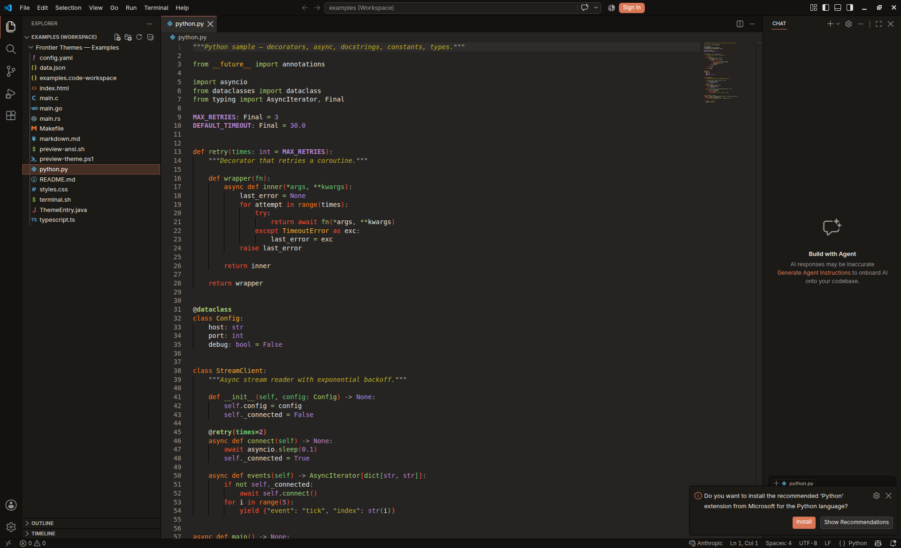
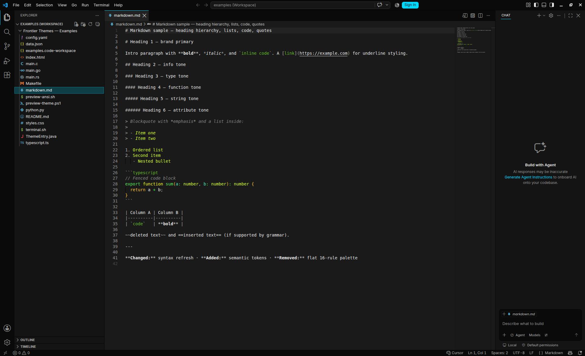
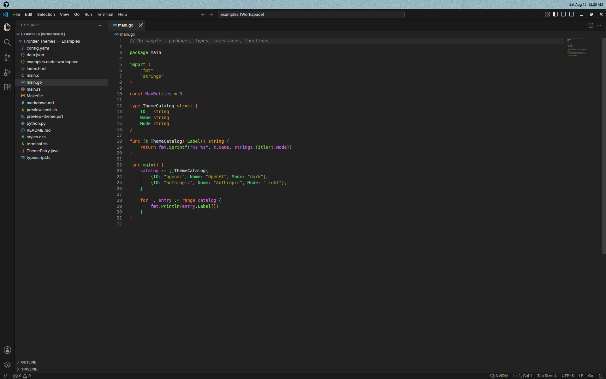
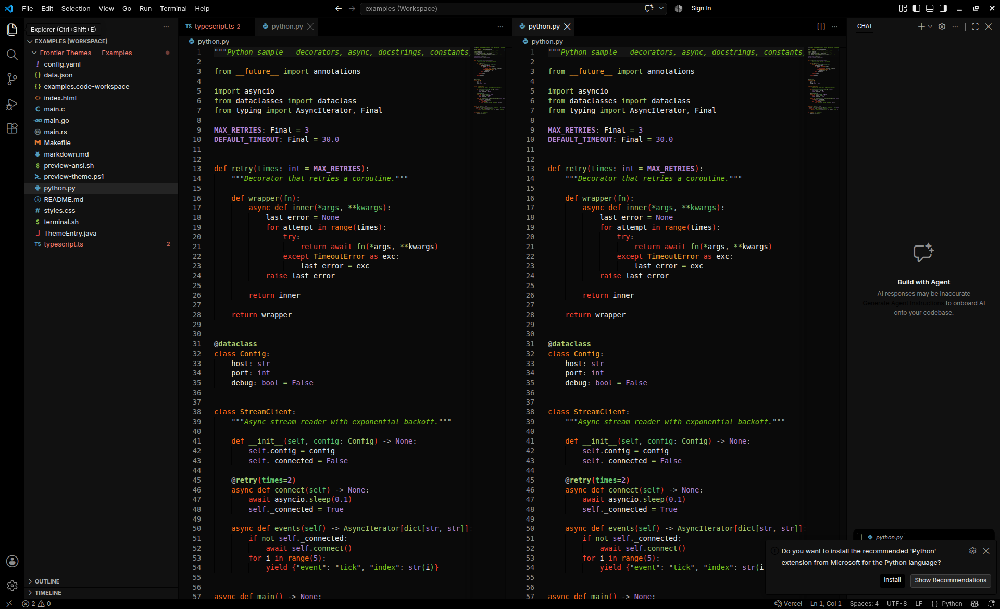

<p align="center">
  <strong>Frontier Themes</strong>
</p>

<p align="center">
  Brand-inspired color themes for VS Code &amp; Cursor — with live preview picker.
</p>

<p align="center">
  
</p>

## About

Frontier Themes is a collection of **48 color themes** (light + dark) inspired by well-known tech companies and AI startups. Each theme includes syntax highlighting, workbench colors, and terminal palettes tuned to that brand.

Use the **status bar picker** to switch themes quickly, **preview with ↑↓** before applying.

> Brand names and colors are inspired by public identities. This project is not affiliated with or endorsed by any company listed.

## Theme previews

<p align="center">
  
  <br><em>Anthropic Dark — Python</em>
</p>

<p align="center">
  
  <br><em>Cursor Dark — Markdown</em>
</p>

<p align="center">
  
  <br><em>NVIDIA Dark — Go</em>
</p>

<p align="center">
  
  <br><em>Vercel Dark — split editor</em>
</p>

## Installation

### Marketplace / VSIX

Launch **Quick Open**

- Linux `Ctrl+P`
- macOS `⌘P`
- Windows `Ctrl+P`

Install from a packaged VSIX:

```bash
git clone https://github.com/EthannHongg/frontier-themes.git
cd frontier-themes
npm install && npm run generate && npm run package
```

Then: Extensions → `...` → **Install from VSIX** → select `frontier-themes-1.2.0.vsix` (from [GitHub Releases](https://github.com/EthannHongg/frontier-themes/releases) or `npm run package`).

Or search **Frontier Themes** on the VS Code Marketplace once published.

### Activate a theme

1. Click **`$(symbol-color)`** in the status bar (bottom-right), **or**
2. Command Palette → **Frontier Themes: Pick Theme**, **or**
3. Gear menu → **Color Theme** → pick e.g. `OpenAI Dark`

## Variants

### Big Tech

| | Dark | Light |
|---|:---:|:---:|
| Google | ✓ | ✓ |
| Apple | ✓ | ✓ |
| Meta | ✓ | ✓ |
| Amazon | ✓ | ✓ |
| Netflix | ✓ | ✓ |
| Microsoft | ✓ | ✓ |
| NVIDIA | ✓ | ✓ |
| Tesla | ✓ | ✓ |
| SpaceX | ✓ | ✓ |
| Salesforce | ✓ | ✓ |
| Adobe | ✓ | ✓ |
| IBM | ✓ | ✓ |

### AI & Startups

| | Dark | Light |
|---|:---:|:---:|
| OpenAI | ✓ | ✓ |
| Anthropic | ✓ | ✓ |
| Perplexity | ✓ | ✓ |
| Cursor | ✓ | ✓ |
| Mistral | ✓ | ✓ |
| Cohere | ✓ | ✓ |
| Stability AI | ✓ | ✓ |
| Hugging Face | ✓ | ✓ |
| Replicate | ✓ | ✓ |
| Vercel | ✓ | ✓ |
| Linear | ✓ | ✓ |
| Figma | ✓ | ✓ |

## Features

### Theme picker with color swatches

The quick-pick menu shows a **color swatch icon** per theme (primary, secondary, accent on the editor background).

### Live preview (↑↓)

While the picker is open:

- **↑ / ↓** — instantly preview the highlighted theme
- **Enter** — apply the selection
- **Esc** — cancel and **revert** to your previous theme

## Commands

| Command | Description |
|---------|-------------|
| `Frontier Themes: Pick Theme` | Open picker with swatches and live preview |
| `Frontier Themes: Pick by Category` | Big Tech or AI & Startups first |

## Settings

| Setting | Default | Description |
|---------|---------|-------------|
| `frontierThemes.showStatusBarPicker` | `true` | Status bar theme picker |

## Theme architecture

Themes are generated from modular sources in `scripts/theme/`:

| Module | Purpose |
|--------|---------|
| `derive-palette.mjs` | Brand → semantic color roles |
| `workbench/` | Shell, editor internals, merge conflicts |
| `tokens/` | Base + Python, JS/TS, Markdown, CSS, HTML |
| `semantic-colors.mjs` | LSP semantic token map |
| `extensions/` | GitLens + Jupyter notebook keys |
| `terminal.mjs` | Curated ANSI palette |

Each generated theme includes **~367 workbench keys**, **~130 TextMate rules**, and **semantic token colors**.

```bash
npm run generate   # regenerate themes/ from scripts/
npm run lint:themes # validate all 48 theme JSON files
npm run check      # generate + lint
npm run dev        # watch brands.json and regenerate on change
npm run package    # build .vsix
```

Press **F5** in VS Code to launch an Extension Development Host.

### Preview samples

Open the [`examples/`](examples/) folder (or `examples/examples.code-workspace`) to view language samples that exercise syntax, semantic tokens, brackets, Markdown headings, CSS/HTML, JSON, and terminal ANSI colors.

## Contributing

Report bugs and suggestions on [GitHub Issues](https://github.com/EthannHongg/frontier-themes/issues).

## Credits

- [Gruvbox Theme](https://github.com/jdinhify/vscode-theme-gruvbox) — README structure inspiration
- Original OpenAI & Anthropic palettes from the early local theme pack

## License

MIT — see [LICENSE](LICENSE).

Copyright (C) 2026 [EthannHongg](https://github.com/EthannHongg)
